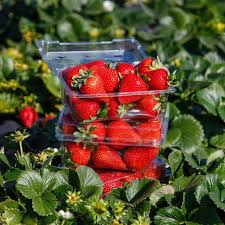
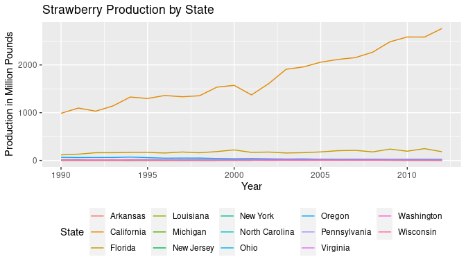
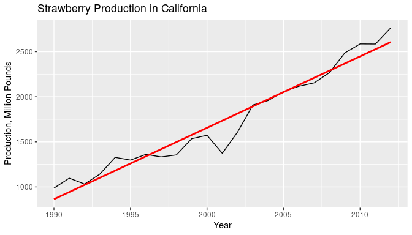
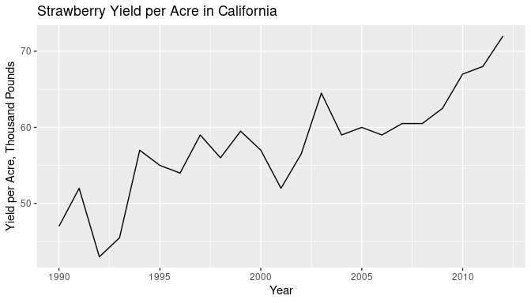
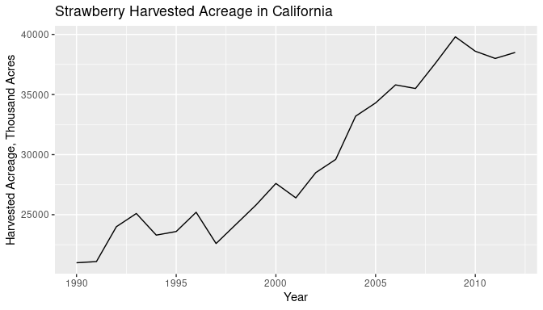
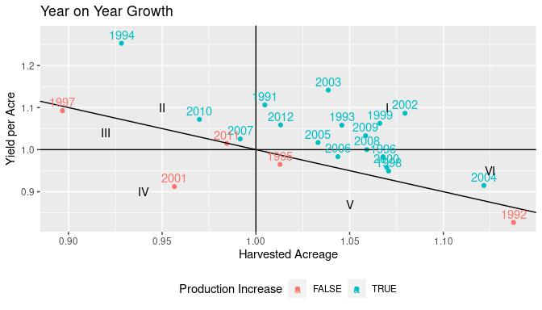
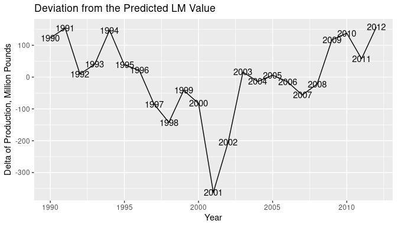

**Agriculture Report**

Nikita Tkachenko

June 12, 2021

# Introduction

California is the heart of the United States&#39; agriculture. Over the third of vegetables and two-thirds of all fruits and nuts are grown here. The Mediterranean climate allows for the production of a large variety of crops with high yields. California-grown vegetables have high levels of valuable nutrients (Howard et al. 1962). For certain crops, like strawberries, there is a difference between organic and inorganic cultivation methods (Yadav et al. 2016). California is world-famous for the size and taste of its strawberries. The production of strawberries is highly profitable but also risky because of many diseases affecting the crop.

_California Strawberries_

**Figure 1:** California Strawberries

## Production

California is the leading producer of strawberries in the United States, responsible for over 90% of the fruit. The production of strawberries has been steadily increasing since 1962. The demand for strawberries was primarily fueled by the increased prosperity of the nation, population growth, and trends for a healthy lifestyle. (&quot;Strawberries&quot; 2019)

### Yield per Acre

The increase in the yield can be attributed to the successful implementation of a number of practices such as drip irrigation, four-row bed system, competitive cultivars, effective fertilizers, and fumigation.(Voth and Bringhurst 1990)

### Harvested Acreage

The increase in acreage is attributed mainly to the demand for the crop as well as the transition to less yielding but more profitable organic production. ## Organic Organic strawberries have been on the rise, with consumers demanding healthy and tasty fruits. Organic production methods are less efficient when it comes to yields. Yet, organic strawberries can be more profitable to farmers because of the high demand and prices while being less damaging to the environment. (Gliessman et al. 1996) Additionally, organic strawberries have better taste characteristics and a higher concentration of valuable nutrients than their conventional counterpart.(Nunes and Delgado 2012)

## Methyle Bromide

Methyl bromide has been used since the 1950s by California strawberry farms to protect the crop from soilborne diseases such as Verticillium wilt. Verticillium wilt was the major limiting factor in 1950, so the fumigation with methyl bromide was introduced. The fumigation was so effective that more than 90% of all commercial strawberry fruit in California used this technique. Nonetheless, methyl bromide was connected to ozone depletion, and its use was banned in 2005; however, the strawberry industry received an exemption until 2016. Registration of a safe and effective fumigant is highly unlikely, so crop losses due to soilborne diseases are likely to increase. (Holmes et al. 2020)

# Methods

I have used the Strawberry data to analyze growth of the strawberry production in California. In my analysis, I have utilized linear regression modeling to identify the trend and deviations.

## Data

Strawberry production, yield, and acreage data were taken from the USDA Economic Research Service (available at [http://usda.mannlib.cornell.edu/MannUsda/viewDocumentInfo.do?documentID=1381](http://usda.mannlib.cornell.edu/MannUsda/viewDocumentInfo.do?documentID=1381)).

## Analysis

I used R language (R Core Team 2013) with ggplot2 (Wickham 2016) to visualize my data, tidyr (Wickham 2021) to clean my data, and dplyr (Wickham et al. 2021) to manipulate my data.

# Results

\
**Figure 1:** California is by far the largest producer of strawberries in the United States. 

\
Coefficients:
Estimate Std. Error t value Pr(\&gt;|t|)\
(Intercept) -1.567e+05 7.987e+03 -19.62 5.50e-15 \
year 7.918e+01 3.991e+00 19.84 4.41e-15 \
Residual standard error: 127 on 21 degrees of freedom\
Multiple R-squared: 0.9493, Adjusted R-squared: 0.9469\
F-statistic: 393.6 on 1 and 21 DF, p-value: 4.412e-15\
**Figure 2:** A linear regression line shows that the production of strawberries in California is increasing over time. This relationship is significant (p \&lt; 0.001, R^2 = 0.9493). However, there was an evident dip in production in the year 2001.

\  
**Figure 3:** Stawberry yield has been increasing over the last two decades. However, there are two observable troughs in 2001 and 1992.

\
**Figure 4:** Harvested acreage has been steadily increasing. Yet there was a significant decline in 1997. 

\
**Figure 5:** The plot shows Year on Year growth of the Harvested Acreage (x) and Yield per Acre (y). The plot is devided into follow zones. I - Yield and Acreage increased in that year. II Yield per Acre increase compensated for Harvested Acreage decrease. III Yield per Acre did not fully off set Harvested Acreage decline. IV both Yield and Acreage declined. V Acreage increase did not off set Yield decline. VI Acreage increase compensated for Yield decrease. 2001 is the only year in zone IV.

\
**Figure 6:** 2001 has the largest deviation from the predicted by Linear Model value.

# Discussion

Production of strawberries in California has been steadily increasing over the last two decades, driven by the simultaneous increase in acreage and yields. Nonetheless, production did not grow in all years. The most notable declines happened in 2001, which is the only year ( **Figure5** ) where yield and acreage decreased—some years&#39; performance is particularly interesting. Let us have a look at them.

## Year 2001

Many strawberry farmers have reported that they lost production at the end of the season because of the methyl bromide use regulation imposed by the California Department of Pesticide Regulation in 2001 (Carter C 2005). The costs for the California strawberry industry amounted to $26 million total.

## Year 1997

During 1997, favorable spring and winter weather produced a high yield of strawberries, offset by the decreased harvest area. (Commercial Agriculture Division 1997)

## Year 1994

Efficient irrigation, durable and improved varieties of strawberries, and other advances throughout the industry have led to substantially more efficient production of 33 tons per acre in 1994, an almost 10-ton increase from 1972. (&quot;Cultivating a winning crop &quot; 1995)

## Future

We can expect a decline in the production of strawberries soon as more growers transition to the more profitable but less yielding organic production. However, this decline will be compensated by the development of more efficient practices as well as an increase in acreage as demand for strawberries will continue to surge in the future. Nonetheless, climate change in California can unpredictably impact agriculture, with floods, droughts, freezes, and diseases becoming more threatening to the production each year.

# Sources Cited

Carter C, G. R., Chalfant J. 2005. Costs of 2001 methyl bromide rules estimated for california strawberry industry. Calif agr 59(1):41-46. California Agriculture 59:41–46.

Commercial Agriculture Division, U. S. D. of A., Economic Research Service. 1997. Fruit and tree nuts situation and outlook.

Cultivating a winning crop : Strawberries take root and thrive in county&#39;s perfect climate. 1995, May. Los Angeles Times.

Gliessman, S., M. Werner, S. Swezey, E. Caswell, J. Cochran, and F. Rosado-May. 1996. Conversion to organic strawberry management changes ecological processes. California Agriculture 50:24–31.

Holmes, G. J., S. M. Mansouripour, and S. S. Hewavitharana. 2020. Strawberries at the crossroads: Management of soilborne diseases in california without methyl bromide. Phytopathology 110:956–968.

Howard, F. D., J. H. MacGillivray, M. Yamaguchi, and others. 1962. Nutrient composition of fresh california-grown vegetables. Bulletin of the California Agricultural Experiment Station.

Nunes, M., and A. Delgado. 2012. Quality of organic compared to conventionally grown strawberries at the retail level. Pages 723–730 VII international strawberry symposium 1049.

R Core Team. 2013. R: A language and environment for statistical computing. R Foundation for Statistical Computing, Vienna, Austria.

Strawberries. 2019, April. Agricultural Marketing Resource Center.

Voth, V., and R. S. Bringhurst. 1990. Culture and physiological manipulation of california strawberries. HortScience 25:889–892.

Wickham, H. 2016. ggplot2: Elegant graphics for data analysis. Springer-Verlag New York.

Wickham, H. 2021. Tidyr: Tidy messy data.

Wickham, H., R. François, L. Henry, and K. Müller. 2021. Dplyr: A grammar of data manipulation.

Yadav, S. K., U. Khokhar, S. D. Sharma, and P. Kumar. 2016. Response of strawberry to organic versus inorganic fertilizers. Journal of Plant Nutrition 39:194–203.
